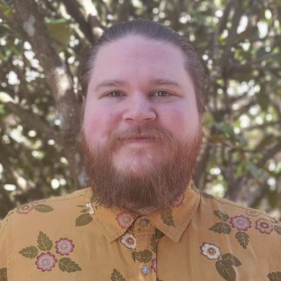

## All about me

Cullen (He/They) is a data analyst and programmer based in Portland, Oregon. He focuses on projects using Python, R, and SQL.

He enjoys solving complex problems and researching new understanding.

Cullen is also an audio engineer who has worked in theatre, recording, and live music.

His hobbies include painting and modeling miniatures, tabletop roleplaying, playing bass, and cooking. He also enjoys spending time with his animals, [Socks and Ludwig.](../assets/Ludwig+Socks.jpg)

[Link to my LinkedIn](https://www.linkedin.com/in/cullen-elliott-wright-7181492a0/)
